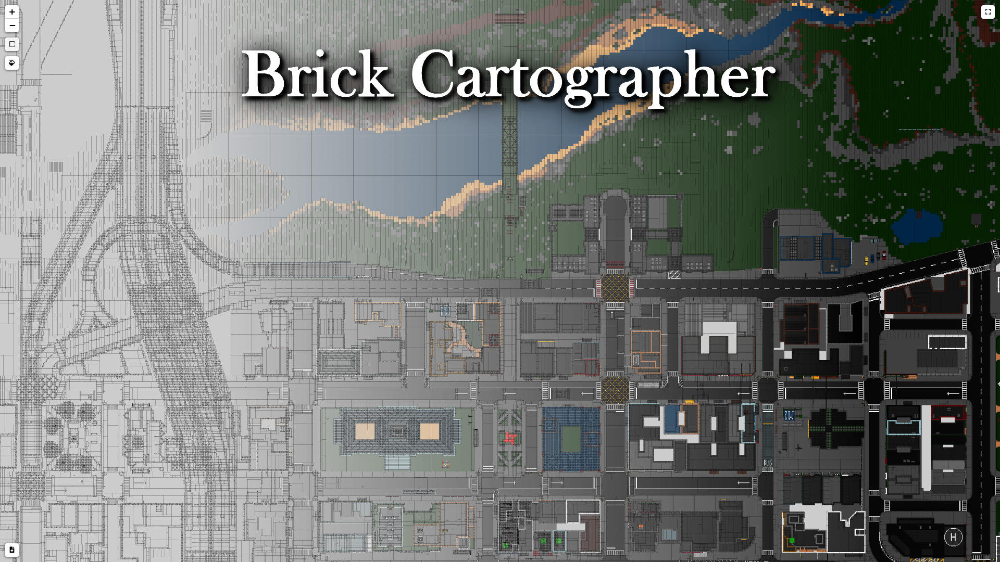

[](https://github.com/Kmschr/BrickCartographer/actions/workflows/rust.yml)
# Brick Cartographer

Brick Cartographer is a fan-made tool for mapping savefiles for [Brickadia](https://brickadia.com/), a multiplayer brick building game. It uses WebAssembly and WebGPU to allow for high performance rendering of large builds from a web browser, falling back to WebGL2 where WebGPU isn't available.



## Layout

| Crate | What it is |
| --- | --- |
| `crates/core` | Save parsing, geometry, and the [wgpu](https://wgpu.rs/) renderer. No browser dependencies. |
| `crates/wasm` | `wasm-bindgen` bindings over core, driving the website's canvas. |
| `crates/cli` | `brick-cartographer`, a command line renderer. |

## Website
requires [wasm-pack](https://rustwasm.github.io/wasm-pack/) and [npm](https://nodejs.org/en/)

```
npm run build
```

to hotload for development use
```
npm run dev
```

## Command line

Renders a save to a PNG without a browser, using whatever native graphics
backend is available (Vulkan, Metal, DX12, or GL).

```
cargo run --release -p brick-cartographer-cli -- <save> [options]
```

```
brick-cartographer City.brs                          # City.png at the website's default zoom
brick-cartographer City.brz -o map.png --scale 1.0   # 10x zoom
brick-cartographer City.brdb --heightmap             # color by height
brick-cartographer City.brs --outlines --rotation 30
```

Images larger than one GPU texture are rendered as tiles and stitched, so
build size isn't limited by the graphics device.
