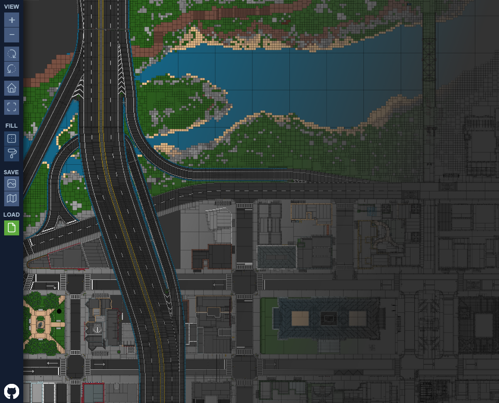

# Brick Cartographer
Brick Cartographer is a fan-made tool for mapping savefiles for [Brickadia](https://brickadia.com/), a multiplayer brick building game. It uses WebAssembly and WebGL to allow for high performance rendering of large builds from a web browser.



## Building
requires [wasm-pack](https://rustwasm.github.io/wasm-pack/) and [npm](https://nodejs.org/en/)

```
npm run build
```

to hotload for development use
```
npm run dev
```